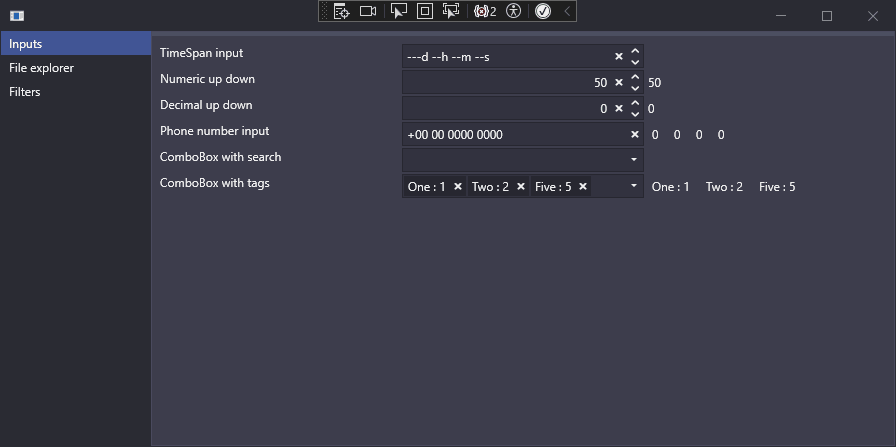

# Wpf components

WPF inputs and components, inputs can be used in most projects and other components are exemples of complexe reusable WPF component.

## Description

Inputs, that can be used in most projects :
- `FormatTextBox` :
    - Accept a format string representing groups (like "{numeric|max:99|padded} and {decimal|max:99}")
    - Each groups are parsed in individual value
    - Handle navigation between groups
    - Handle button to clear and increment / decrement numeric groups
    - Can be used to create other inputs
- `TimeSpanPicker` :
    - Select a TimeSpan value
    - Based on a `FormatTextBox` with format "{max:365}d {max:23}h {max:59}m {max:59}s"
- `NumericUpDown` :
    - Select a long value
    - Based on a `FormatTextBox` with format "{numeric|noGlobalSelection}"
- `DecimalUpDown` :
    - Select a double value
    - Based on a `FormatTextBox` with format "{decimal|noGlobalSelection}"

- `ComboBoxSearch` :
    - Improved ComboBox with that allow to search in the ComboBox Items
    - Accept a `FilterMemberPath` that act like `DiplayMemberPath` for the filter
- `ComboBoxTags` :
    - Allow for multiple items selection
    - Based on `ComboBoxSearch`

FileExplorer, display a folder files and sub folders :
- Real time up date of the content
- Drag & drop of files, zip and outlook attachments
- Allow you to apply specific logic and icon to specific path

> TODO : Could be improved with a better ContextMenu, improved performances, better handling of the node tree refreshes, ...

Filters, visually create a lambda that can be used to filter data :
- Properties are dynamically created from a class type
- Recursively work on the class property
- Differents inputs based on property type

> TODO : Add group creation and drag & drop. This could be done more elegantly.

### Why does this exist

To train myself to create generic components that can easily be used in different projects.
Tried to find the best way to do this since there is several way to acheive this in WPF :
- Derive from ContentControl or other base component
    - Customize with a Dictionnary
        - Is a pain to bind events and data to the UI (even with Commands)
    - Customize with a XAML class directly attached to the component
        - Doesn't allow the consumer to customize the control content easily

## Getting Started

### Dependencies

- Created with Visual studio Community 2022 (64 bits) Version 17.8.4
- Require *.NET Desktop development* workload installed

### Executing program

- Start the project `Joufflu.Samples`

## Acknowledgments

Use :
* [Adonis UI](https://benruehl.github.io/adonis-ui/) for styles
* [Fontawesome](https://fontawesome.com/) icons
* [PropertyChanged.Fody](https://www.nuget.org/packages/PropertyChanged.Fody) for boilerplate

I know [Extended WPF Toolkit](https://github.com/xceedsoftware/wpftoolkit) have already done all the inputs and way more but you can't appreciate something fully without knowing how hard it is to do.
